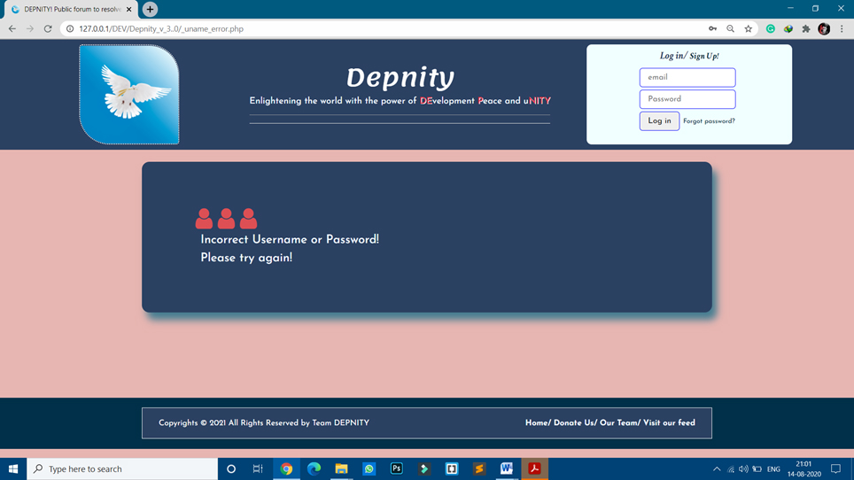
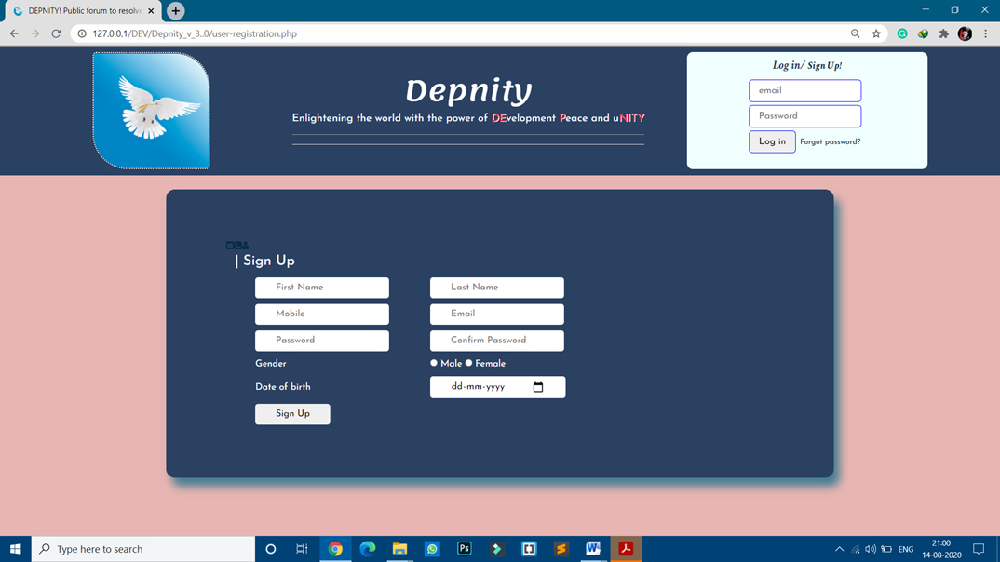
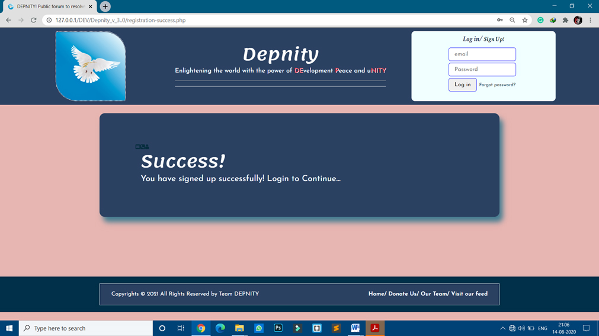
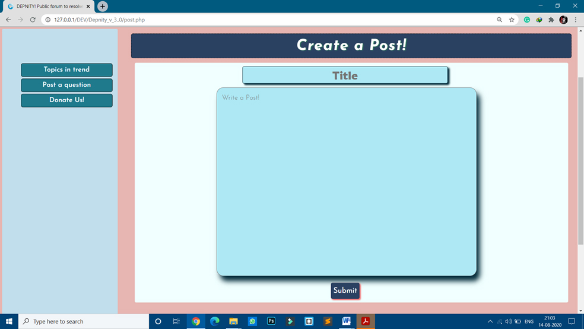
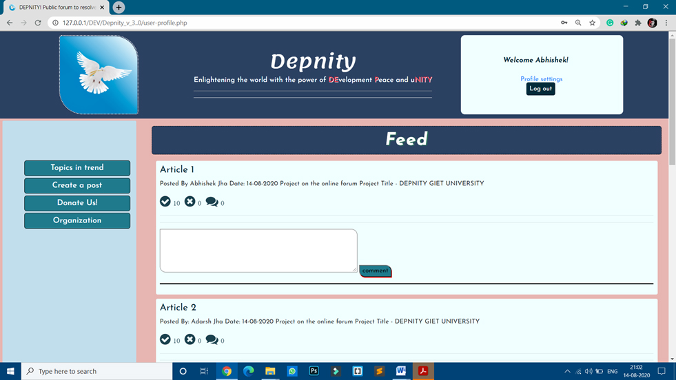
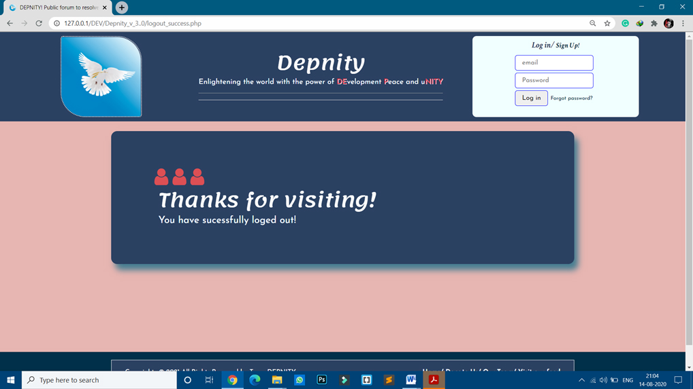

# DepnityOnlineForum
It is a model Online Forum Project which I did in my 1st year.
You can have a look into it and suggest some changes to make it better.

‘DEPNITY’ is a public forum which is developed in PHP where people can come together and discuss over the issues they face while living in the society.

‘DEPNITY’ in itself is an acronym which is derived from the three words, ‘DEvelopment', ‘Peace’ and ‘uNITY’.

### Developer: Mohit Kumar Singh

#### Preview:
     
          
     
 
# **FEEL FREE TO CONTRIBUTE IN MAKING IT BETTER!**
     
### Detailed Preview:     
     
     
     
       
   
   
   
   
      
   
    
   
 
   
    
   
